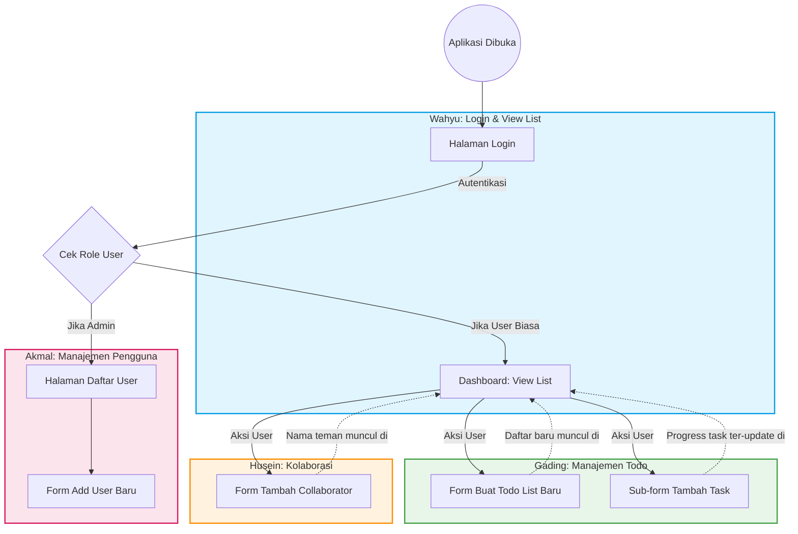

# Alur Aplikasi Berdasarkan Pembagian Fitur (Project Manager)

Dokumen ini berisi diagram alur interaksi seluruh fitur aplikasi yang telah dibagikan oleh Project Manager (PM) kepada setiap anggota kelompok (Akmal, Gading, Husein, dan Wahyu).

### Penjelasan Pembagian Tugas:
1. **Wahyu:** Membuat halaman `Login` pertama kali. Jika berhasil masuk sebagai user biasa, akan diarahkan ke halaman utama yaitu `View List` untuk melihat semua daftar Todo beserta status task dan kolaborator.
2. **Akmal:** Membuat panel khusus untuk Admin, yaitu `View User` (melihat daftar akun) dan `Add User` (membuat akun pengguna baru dengan password & akses tertentu).
3. **Gading:** Membuat fungsionalitas inti dari aplikasi Todo, yaitu `Add List` (membuat kategori/daftar tugas baru) dan `Add Task` (menambahkan item tugas ke dalam daftar yang sudah dibuat).
4. **Husein:** Menangani fitur sosial, yaitu `Add Collaborator` untuk mengundang akun lain (berdasarkan username) agar bisa bergabung dan mengerjakan `List` secara bersama-sama.
