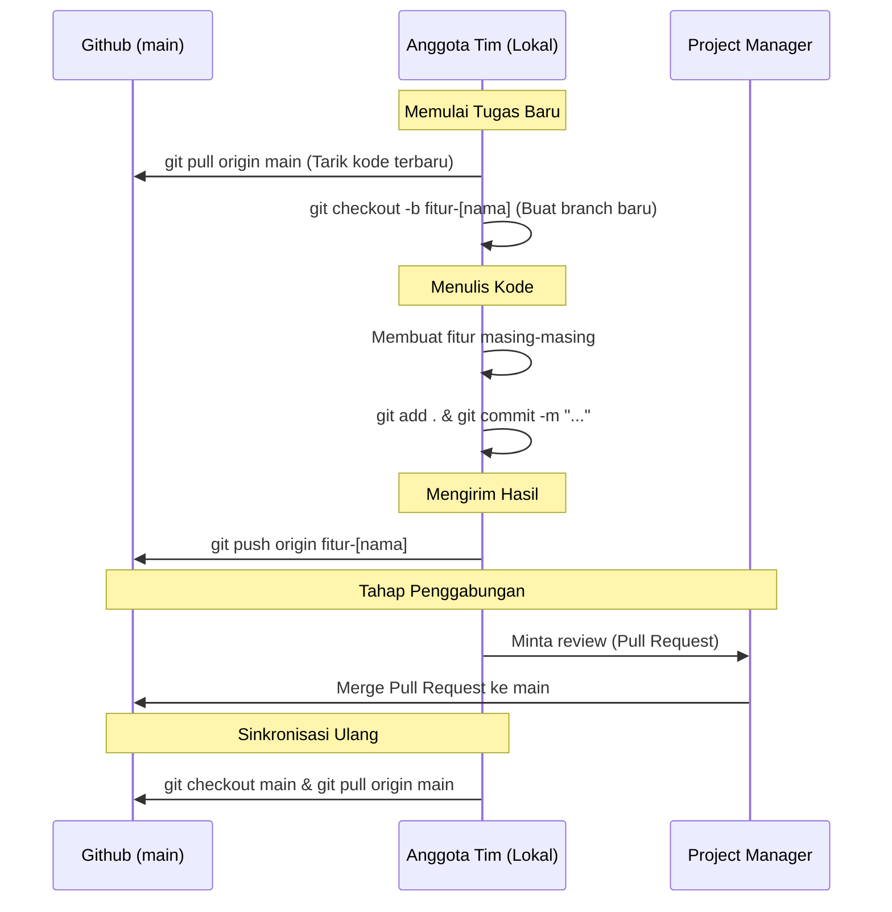
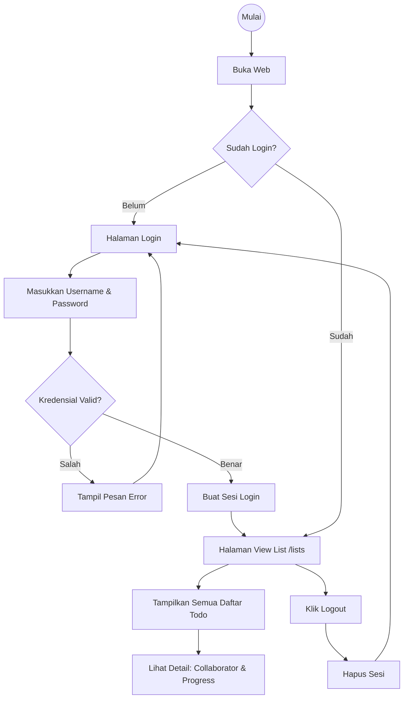

# Alur Kerja (Workflow) Tim PPK Praktikum 2 Kelompok 5

Dokumen ini berisi diagram alur kerja (workflow) untuk kolaborasi tim menggunakan Git, serta alur dari fitur yang sudah selesai dibuat (Login & viewList).

## 1. Alur Kolaborasi Git (Git Workflow)
Diagram ini menunjukkan bagaimana anggota tim (Akmal, Gading, Husein) harus mengambil, mengerjakan, dan menyatukan kode ke repository utama (`main`).

---

## 2. Alur Aplikasi (Fitur Wahyu)
Diagram di bawah ini menggambarkan alur dari fitur aplikasi yang sudah dibuat oleh Wahyu:

